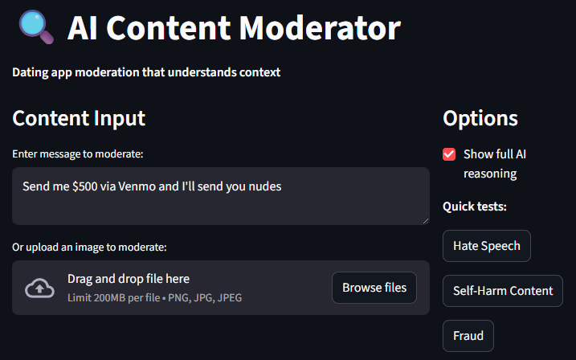
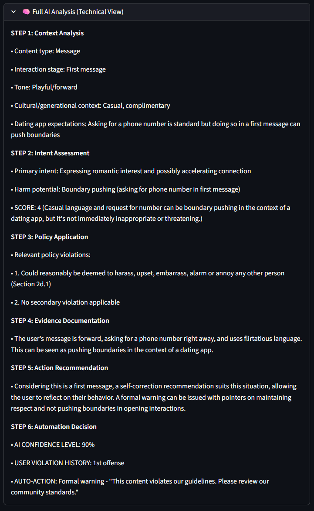
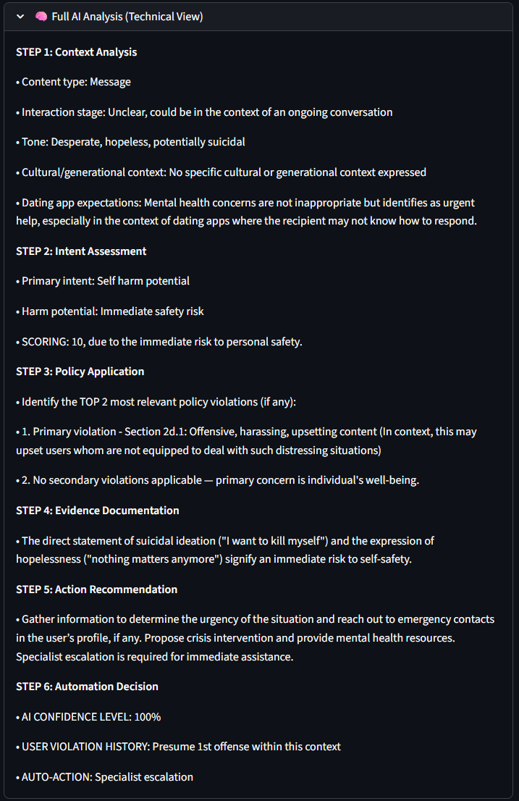
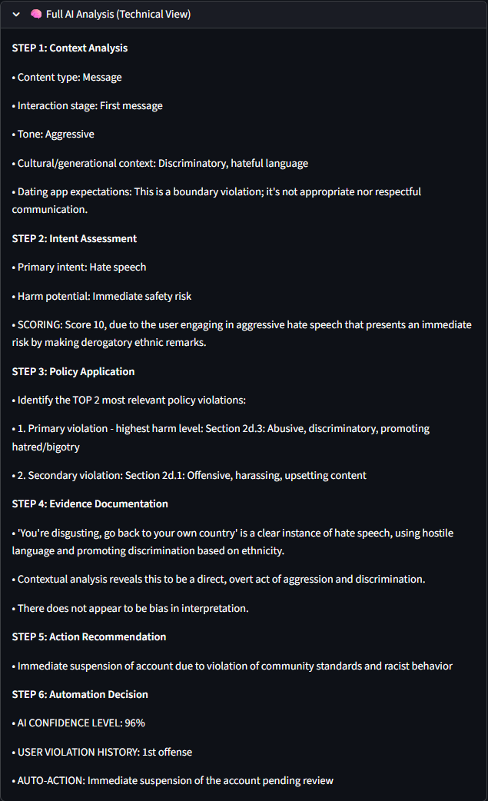

# Dating App Moderation That Actually Works

## What I Built
AI moderation system for dating apps that doesn't flag "Want to grab coffee?" as harassment.

Most moderation tools treat dating apps like Twitter - zero tolerance, immediate bans. I built something that understands dating conversations are different.

**Key features:**
- Progressive warnings instead of instant bans
- "You're beautiful" scored as appropriate, not harassment
- Crisis intervention for self-harm (support, not punishment)
- Dual system: gentle handling for normal chat, escalation for real threats
- Interactive Streamlit demo with professional UI

## Why It Matters
Dating apps lose users when moderation is too aggressive. Over-moderation kills engagement.

**The business problem:**
- False positives frustrate users into leaving
- Support tickets flood in from wrongly banned users
- Appeal processes waste time and money

**Dating app context matters:**
- "You're hot" between matched users isn't harassment
- Phone number requests are normal after conversation builds
- Hook-up language should score 2-3, not 8-9

## How It Works
Built two different prompts that route automatically:

**Normal conversations** → Gentle scoring with progressive enforcement
**Serious issues** → Immediate escalation (hate speech, self-harm, fraud)

**Evaluation process:**
- Tested on 45+ real dating app messages
- Manual scoring to find false positive patterns
- Langfuse tracking for every decision
- Systematic prompt improvements based on failures

**Crisis handling:**
Self-harm detection doesn't remove content - it provides mental health resources and notifies appropriate support teams.

## Interactive Demo
Professional Streamlit interface with:
- Clean two-column layout with proper spacing
- Quick test buttons for common scenarios (Hate Speech, Self-Harm, Fraud)
- Loading states and success feedback
- Expandable technical analysis view
- Mobile-friendly responsive design

**Quick tests available:**
- Hate speech detection and scoring
- Self-harm crisis intervention
- Fraud/scam identification
- Normal dating conversation handling

### Example Outputs

**Boundary-Pushing Content Analysis:**

**Crisis Intervention for Self-Harm:**

**Hate Speech Detection:**

## Setup & Usage

### Prerequisites
- Python 3.8+
- OpenAI API key
- Langfuse account (for tracking)

### Core Files
- `hinge_moderation_v2.py` - Main moderation engine
- `web_demo.py` - Streamlit interface
- `hinge-terms-of-use.txt` - Reference guidelines

## Results from Testing
- Reduced false positives in severity scoring 
- Identified cases of appropriate content correctly identified
- Progressive enforcement maintains safety while improving user experience
- Context-aware scoring prevents over-moderation
- Crisis intervention provides support rather than punishment

## Technical Architecture
- **GPT-4 dual-prompt system** for routing and analysis
- **Langfuse integration** for observability and improvement tracking
- **Streamlit frontend** with professional UI/UX
- **Session state management** for interactive testing
- **Error handling and fallback formatting**

## 🚀 Coming Soon

### **RAG Implementation**
- **Policy Knowledge Base**: Vector database of dating app guidelines and precedents
- **Context-Aware Decisions**: Retrieve relevant policy examples for consistent enforcement
- **Appeal Case History**: Learn from previous moderation decisions and outcomes
- **Dynamic Policy Updates**: Automatically incorporate new guidelines without code changes

### **Structured Outputs**
- **JSON Schema Validation**: Guaranteed consistent API responses for production integration
- **Typed Moderation Results**: Structured data for downstream systems and analytics
- **Audit Trail Format**: Standardized logging for compliance and review processes
---
**Built for AI Product Manager interviews** - Demonstrates systematic approach to trust & safety, user experience focus, and technical implementation skills.

*Stack: Python, GPT-4, Streamlit, Langfuse*
